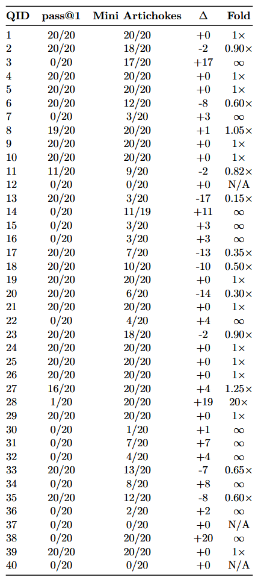

# Mini Artichokes

*Mini Artichokes: Cracking Korea's Hardest Logic Exams with Just Gemma-3-27B (gemma-3-27b-it) via Validated Overlap — PSAT (best-of-20) ≥90 points.*

Mini Artichokes is an API-only self-correction loop for LLM reasoning that reduces drift by:

- Running verification on a candidate answer.
- On failure, collecting two independent diagnoses.
- Extracting the overlap (high-agreement error signature) between the diagnoses.
- Validating that overlap against the failure report.
- Applying a targeted correction conditioned on the validated overlap.

See `mini_artichokes.pdf` for the full method, algorithm, and experimental results.

## What’s in This Repo

- `Mini Artichokes.html`: a self-contained, interactive experiment/results runner.
  - `Core (Mini Artichokes)` includes only `Mini Artichokes` (rcap35) and `pass@1`.
  - All other architectures are grouped under **More Architectures**.
- `mini_artichokes.pdf`: “Mini Artichokes: Reliable Self-Correction from Validated Overlap”.
- `mini_artichokes_overview.png`: system overview diagram (Figure 1).
- `mini_artichokes_psat.png`: PSAT result snapshot.

## Architecture & Usage

- Setting: repeated API calls with no external feedback (no tools, no internet, no human-in-the-loop).
- Tool-free by design: keeps the loop model-agnostic (portable across APIs) and composable as a small module inside larger systems that *do* have tools/validators.
- Core loop: `Solve → Verify → (Diagnose ×2) → Overlap → ValidateOverlap → Correct`, with pass-streak acceptance and fail-streak early stopping.
- Why “validated overlap”: only feed back what two independent diagnoses agree on, then require that overlap to explain the verifier’s failure report (reduces self-correction drift from spurious critiques).
- Budgeting: supports a per-round call cap (`rcap`); the default “Mini Artichokes” configuration uses `rcap35` (`test43-2-rcap35`).
- This runner keeps the paper’s internal checkpoint IDs (e.g., `test2`) so the UI/logs match the appendix tables exactly.

PSAT Linguistic Logic (2025) — best-of-20 (the ≥90 headline above): pass@1 reaches 62.5/100 (25/40 items), while Mini Artichokes reaches 92.5/100 (37/40 items). Overall suite accuracy improves modestly (58.4% → 61.5%), but the gains are most visible in coverage on the hardest questions: Mini Artichokes solves 12 of the 15 items that pass@1 never solves in 20 trials, and on PSAT we do not observe the reverse (an item pass@1 solves at least once while Mini Artichokes has zero successes). We view Mini Artichokes as a fallback module for hard, low-confidence failures rather than a wholesale replacement for pass@1.

## How to Use

1. Open `Mini Artichokes.html` in a modern browser. No build step is required.
2. In **Architecture API Settings**, configure your API keys, URL, and model.
3. In the architecture selector, check the architectures you want to run (Core or **More Architectures**).
4. Click **Run / Resume**.

## License

This repository is licensed under the MIT License (see `LICENSE`).

### Third-party attribution

Mini Artichokes was developed with direct reference to (and in places adapts scaffolding/patterns from) the following open-source codebases:

- **Iterative-Contextual-Refinements** (Apache-2.0) by `ryoiki-tokuiten`: see `LICENSES/Apache-2.0.txt`.
- **IMO25** (MIT) by Lin Yang and Yichen Huang: see `LICENSES/IMO25-MIT.txt`.
